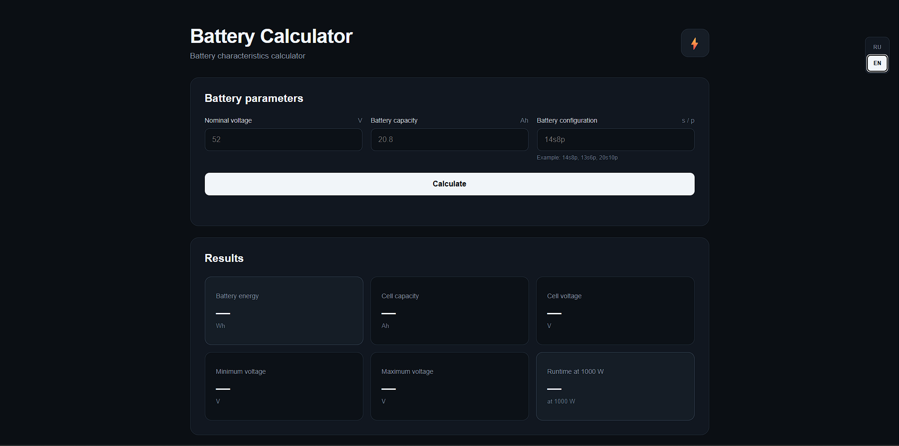

# 🔋 Battery Calculator

A simple and modern web-based calculator for Li-ion and other battery pack configurations.

The calculator allows you to enter your battery parameters and quickly calculate energy capacity, cell characteristics, voltage range, maximum battery current, total number of cells, and estimated runtime.



## ✨ Features

- 🔋 Battery energy calculation in Wh
- ⚡ Custom power consumption input
- 🔢 Support for different battery configurations such as `14s8p`, `13s6p`, etc.
- 🧪 Cell chemistry selection:
  - Li-ion
  - LiFePO4
  - LiPo
- 🔌 Maximum discharge current per cell
- 📊 Maximum theoretical battery current
- 🔢 Total number of cells
- 🔋 Capacity of an individual cell
- ⚡ Nominal cell voltage
- 📉 Minimum pack voltage
- 📈 Maximum pack voltage
- ⏱️ Estimated runtime at the selected power
- 🌐 Russian and English language support
- 📱 Responsive design for desktop and mobile devices
- 📈 Vercel Analytics
- ⚡ Vercel Speed Insights

## 🧮 Calculations

### Battery Energy

The calculator determines the total energy stored in the battery:

```text
Energy (Wh) = Voltage (V) × Capacity (Ah)
```

## 🚀 Running Locally

No build tools are required.

Simply clone the repository:
```text
git clone https://github.com/Suzixx/BatteryCalculator.git
```
Open the project directory:
```text
cd BatteryCalculator
```
Then open index.html in your browser.

## 📌 Disclaimer

This calculator is intended for educational and estimation purposes.

The results are theoretical and may differ from real-world battery performance due to factors such as:

Voltage sag
Cell resistance
Temperature
Battery age
Cell condition
BMS current limits
Controller efficiency
Load variation
Wiring and connector losses
Differences between cell manufacturers and models

Always use the actual specifications provided by the cell manufacturer when designing a battery pack.

## 🌐 Main Link

The official website link to use: https://batterycalculator.vercel.app

## 📄 License

This project is licensed under the MIT License. See the LICENSE file for details.

## 👨‍💻 Author

Created by Suzixx.

If you find the project useful, feel free to ⭐ the repository or suggest new features.
